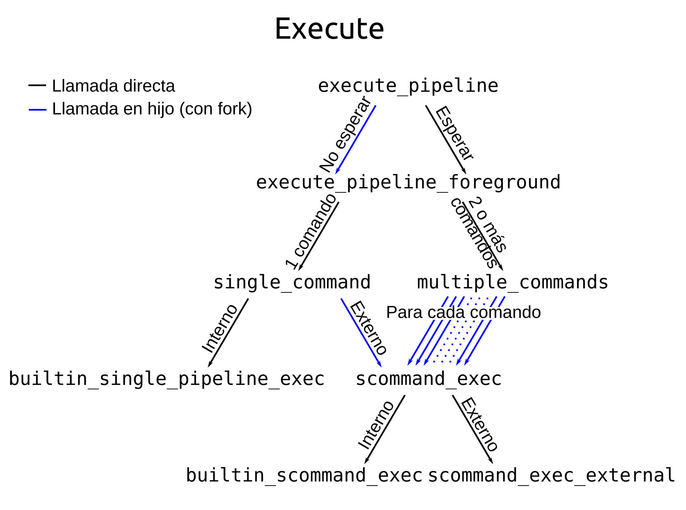

# Informe lab 1

- Fuentes, Tiffany
- Renison, Iván
- Vispo, Valentina Solange

---

**[README](README.md) | [CONSIGNA](consigna.md) | [To Do](todo.md)**

---

# Contenido

- [¿Cómo correrlo?](#¿Cómo-correrlo?)
  - [Correr nuestros tests](#Correr-nuestros-tests)
  - [Debugger](#Debugger)
- [Comprensión](#Comprensión)
  - [Archivos .h](#Archivos-.h)
  - [Valgrind: memory leaks de la librería](#Valgrind:-memory-leaks-de-la-librería)
  - [Command](#Command)
    - [Funciones command](#Funciones-command)
  - [Builtin](#Builtin)
    - [Funciones builtin](#Funciones-builtin)
  - [Syscall](#Syscall)
    - [Sobre el funcionamiento de cd en el parser y su funcionamiento en Bash](#Sobre-el-funcionamiento-de-cd-en-el-parser-y-su-funcionamiento-en-Bash)
  - [Execute](#Execute)
    - [Los procesos zombies](#Los-procesos-zombies)
    - [Error en test](#Los-tests-de-execute)
  - [Parser](#Parser)
- [Extra: nuestra-forma-de-trabajar](#Extra:-nuestra-forma-de-trabajar)

# ¿Cómo correrlo?
```bash
make
```

```bash
./mybash
```

## Debugger
```bash
make
```

```bash
valgrind ./mybash
```

# Comprensión

    Explicaciones simples de lo que hemos ido comprendiendo de los conceptos que fuimos implementando.

## Archivos .h

    Decidimos invertir el orden de las descripciones de las funciones para que en los editores de texto al pasar el cursor por encima se logre visualizar el mismo y que no sea necesario entrar a *recordar* el código de esa función o ir directamente al archivo **.h**, lo cuál nos permite ahorrarnos tiempo.

## Command

    El primer módulo que implementamos fue el módulo `command`. En este módulo dejemos casi toda la interfaz (ósea lo de `.h`) igual. Las únicas modificaciones que hicimos fueron las siguientes:

    Agregamos la función `scommand_front_and_pop` que elimina el primer elemento de un `scommand` y lo devuelve. Esta función la usamos adentro de `scommand.c`, pero no la usamos en ningún otro lugar del código, pero nos pareció buena idea dejarla en el `.h`, ya que podría llegar a ser útil para algo.

    Agregamos la función `scommand_get_nth` que obtiene el n-avo elemento del `scommand`. Está función la agregamos para poder usarla en la función que ejecuta el comando `cd` en el módulo `builtin`. No era necesario usarla, pero si nos parecio mas eficiente y prolijo.

    Agregamos la función `scommand_to_argv` que toma un `scommand` y devuelve un vector de `char*` terminado en `NULL`, que tiene todas las palabras del `scommand`. Esta función la usamos en el módulo `execute` para convertir el `scommand` en un un vector para pasarle a `execvp`.

    Modificamos las pos-condiciones de `scommand_to_string` y `pipeline_to_string` para no tener que llamar a `exit` en caso de que falle el alocado de memoria.

### Implementación

    Para implementar los `scommand` y los `pipeline` hace falta algún **TAD** tipo lista. Nosotros usamos el TAD `GSList` de la libraría `glib.h`. Posiblemente hubiera sido mas eficiente usar `GQueue` o `GSequence`, pero en el esqueleto estaba empezado con `GSList`, y cuando empezamos a hacer el proyecto, como todavía estabamos comenzando, decidimos continuar con la misma librería. Después nos fuimos dando cuenta de que todo estaba medio pensado para que cambiamos cosas si queriamos, pero como ya habíamos terminado lo dejamos con la librería que tenía inicialmente.

### Valgrind con `GSList`

    Por como están optimizados los TAD de `glib`, al ejecutar con `valgrind` aparece en la categoría `still reachable` del `LEAK SUMMARY` muchos bytes, que **no son memory leaks**, pero `valgrind` los detecta. Para poder distingir esos leaks de los propios lo que se puede hacer es compilar con el flag `-g` y ejecutar valgrind con el flag `--leak-check=full`. Esto lo que hace es mostrar el origen de los leaks en los archivos compilados con `-g`, entonces, como `glib` no está compilado con `-g`, solo muestra el origen si son memory leaks causados por el código propio.

## Builtin

    El módulo `builtin`, en el esqueleto venía con una función que decidía si un `pipeline` es interno, otra función que ejecutaba un `pipeline` de comandos internos y además, para cada comando interno, una función que decidía si un `pipeline` era ese comando interno.

    Nosotros decidimos cambiar eso, ya que nos pareció que todas esas cosas eran cosas que aplicaban a un comando simple, y no a un pipeline, por lo cuál re-estructuramos el módulo de la siguiente manera:

- Por cada comando interno, una función de la forma `builtin_scommand_is_` que toma un `scommand` y decide si es ese comando interno.

- Por cada comando interno, una función que toma un `scommand`, lo ejecuta y retorna (*es muy importante que retorne, ya que los comandos internos a veces son ejecutados en el hilo principal del programa*). Estás son las funciones de la forma `builtin_run_`, y no están en el `.h`.

- El resto de las funciones son:

```c
bool builtin_scommand_is_internal(const scommand cmd);
bool builtin_scommand_is_single_internal(const pipeline pipe);
void builtin_scommand_exec(const scommand cmd);
void builtin_single_pipeline_exec(const pipeline pipe);
```

Que hacen lo que su nombre indica (en el `builtin.h` está mas detallado).

    Como se puede ver, no hay ninguna función que tome un `pipeline` de comandos internos y lo ejecute, o algo similar. Esto se debe a que los `pipeline` de varios comandos se ejecutan de la misma manera, tanto si tienen comandos internos, externos o ambas cosas mezcladas.

    Una consecuencia de eso, es que los comandos internos, cuando están en un `pipeline` de varios comandos se ejecutan en un hijo, y por ende, los que modifican el estado de la terminal (como por ejemplo `cd` y `exit`) no tienen efecto (en `bash` tambien es así).

### Syscall

`cd ~` desde el home

`cd /` desde el sistema

`cd ./` o `cd ` desde el directorio actual

### Sobre el funcionamiento de cd en el parser y su funcionamiento en Bash

    En el GNU Bash, es lo mismo ejecutar `cd ~` y `cd `, ambas sirven para cambiar al directorio principal, en el caso de que se cree una carpeta o directorio llamado `~` al ejecutarse `cd ~` no se cambia a la carpeta/directorio creado, se cambia al directorio principal, en caso de querer referirse a una carpeta/directorio llamado `~` se debe ejecutar `cd '~'`, de igual forma para acceder a alguna carpeta o subdirectorio en el mismo, sebe ejecutar `cd '~'/archivos` por ejemplo, en caso de que tal carpeta se llame "archivos".

    La implementación en este bash es similar, también, al igual que en el GNU Bash, en caso de que se cree una carpeta/directorio que tenga archivos adicionales ademas del `~`, por ejemplo `~archivos` no hace falta utilizar las comillas simples para cambiar a ese directorio, es decir se puede hacer `cd ~archivos`.

También es importante mencionar que en caso de que algún subdirectorio/carpeta se llame `~`, no es necesario utilizar las comillas simples al referirse al mismo, ya que solo se analiza el directorio principal para ver si es una llamada al directorio principal, o si es una llamada a un directorio llamado `~`.

    Ejemplo: `path = ~/Archivos/~`
Se debe ejecutar `cd '~'/Archivos/~`, y no `cd '~'/Archivos/'~'`, en el GNU Bash cualquiera de los dos funciona, pero en nuestra implementación sólo se debe colocar `'~'` en el directorio si se refiere a un directorio/carpeta llamado `~`.

## Execute

    El módulo `execute` cuenta con una sola función en el `.h` que es `execute_pipeline`, y que se encarga de ejecutar un pipeline. En el `.c` hay una gran cantidad de funciones auxiliares que se llaman unas a otras.

    Cada función tiene arriba una descripción de que hace, y las pre y pos condiciones que tiene.

    A continuación hay un diagrama de como son las llamadas entre las funciones, en el cuál se puede ver cuando se hacen llamadas normales, y cuando se hacen llamadas haciendo primero un `fork` y llamando en el hijo.

<html></html>

    Hay varias cosas que pueden resultar un poco extrañas sobre como están las llamadas. El motivo es para evitar que queden procesos zombies.

### Los procesos zombies

    Cuando los procesos hijos terminan no son borrados por completo de la memoria de forma automática, si no se se guarda cierta el información sobre la terminación del proceso para que el padre pueda acceder a esa información, y recien cuando accede esa información se borra. En C, con la función `wait` se puede esperar a que algún proceso hijo termine y obtener la información.

    Para ejecutar los pipelines la información de como termino no es necesaria para nada, y es necesario esperar a que el proceso hijo termine solo cuando el `pipeline` está seeteado para esperar.

    Si la única diferencia que se hace entre cuando esta para que espere, y cuando no, es hacer o no llamadas a `wait` después de crear los procesos hijos, lo que pasa es que cuando está seetado para que no espere los hijos terminan y quedan como procesos zombies.

    Para solucionar eso, lo primero que se nos había ocurrido fue hacer una función que *terminara todos los hijos zombies existentes* (usando `waitpid`), y a esa función llamarla en cada ciclo de `while` en la función `main`. Sin embargo, esa solución no es muy buena, porque solo se eliminan los zombies cuando se presiona enter en el `mybash`, y por ende pueden quedar un tiempo los procesos zombies.

    Luego encontramos que cuando un proceso termina antes que sus procesos hijos, los mismos pasan a ser hijos de `init` y no se convierten en zombies al terminar, por lo cuál, hicimos que al ejecutar un `pipeline`, si está seeteado para que no espere, lo que se hace es crear un hijo que sea el encargado de crear todos los hijos (nietos del original), y a ese hijo, hacer que termine con `exit` cuando termina de crear todos los hijos. De esa forma, desde el proceso principal solo se espera a ese hijo, y cuando ese hijo termina, todos sus hijos (nietos del original) pasan a ser hijos de `init`.

### Los tests de execute  

    Esa forma que encontramos de manejar los procesos zombies hace que al correr los test (`make test`) sale un error:

```log
test_execute.c:192:F:Functionality:test_external_1_simple_background:0: Assertion 'mock_counter_wait+mock_counter_waitpid == 0' failed
```

    Esto se debe a que los test esperan que cuando el `pipeline` está seeteado para que no espere no se haga ningún `wait`, que sería lo lógico si se ignoraran los procesos zombies. Sin embargo, nosotros si estamos haciendo un `wait` para esperar al procesos que crea todos los hijos, y por eso es que los tests no dan.

# Extra: nuestra forma de trabajar

1. En el archivo [todo.md](todo.md) se encuentran las diferentes consignas y tareas que realizabamos (no siempre es commiteado).

2. Pair programming con la extensión de [Live Share](https://visualstudio.microsoft.com/services/live-share/) de Visual Studio Code.

3. Comunicación: [Telegram](https://web.telegram.org/) y [Discord](https://discord.com/)

### Redación del informe:

    Para redactar el informe un miembro del grupo se encargo, y los demás ayudaron. Esto para mantener más coherencia y el mismo estilo.

### Estilo del código

    Para mantener todo el código con el mismo estilo usamos el formateador de `clang`, por lo cuál tenemos un archivo llamado `.clang-format` que tiene la configuración de formateo. Esta toma como base una configuración llamada `LLVM`, y hace algunas modificaciones (ver el archivo para verlas).

    Este formateador se puede usar directo desde vscode con la extención c/c++ agregando la siguente linea en el `.vscode/settings.json`:

```json
"C_Cpp.clang_format_style": "file"
```

Configuración:

**.clang-format**

```yaml
BasedOnStyle: LLVM

IndentWidth: 4
PointerAlignment: Left
ReflowComments: false
```

**.vscode/settings.json**

```json
{
    "C_Cpp.clang_format_style": "file",
    "files.associations": {
        "*.s": "arm",
        "stdio.h": "c",
        "functional": "c",
        "strextra.h": "c",
        "builtin.h": "c",
        "cstdio": "cpp",
        "fstream": "cpp",
        "glib.h": "c",
        "random": "c",
        "stdlib.h": "c",
        "assert.h": "c",
        "unistd.h": "c"
    }
}
```

Referencia:

- [ClangFormatStyleOptions](https://clang.llvm.org/docs/ClangFormatStyleOptions.html)

---

**[README](README.md) | [CONSIGNA](consigna.md) | [To Do](todo.md)**
